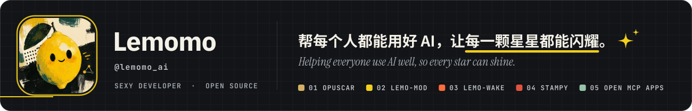
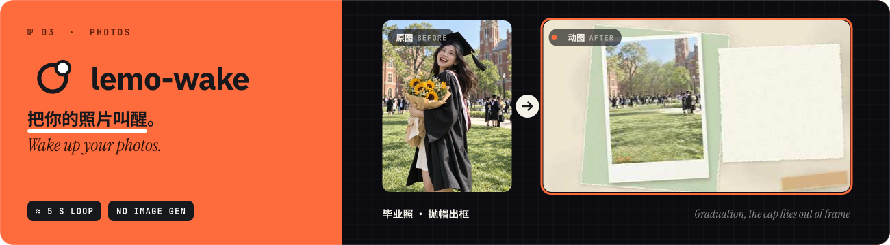
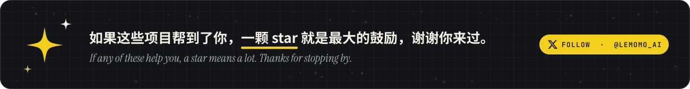

<b>程序员，独立开发者。致力于分享真正好用的方法做成开源项目，让每个人都能用 AI 得到更好的结果。</b> 
<b>Programmer and indie developer. I turn methods that truly work into open-source projects, so everyone can get better results with AI.</b>

## 🎬 Lemo-Opuscar

<b>43 种影片风格，非视频模型，用 Claude 纯代码生成短片。</b>提供风格提示词、导演提示词与技术指南。选一个风格，说出你想拍的内容，剩下交给 agent。更多风格持续更新中。 
<b>43 film styles, no video model: Claude makes short films in pure code.</b> With style, director and technical guides: pick a style, say what to shoot, and let your agent do the rest.

## 🍋 lemo-mod

<b>一键给 Claude Code 换上新风格：21 套风格，终端和桌面 App 都能用。</b>不只换皮：面板、用量横条、消息编号、写周报、番茄钟、会话小结等 16 个 mod，按需打开。更多功能持续更新中。 
<b>Re-skin Claude Code in one click: 21 styles for the terminal and the desktop app.</b> Plus 16 mods like panels, usage bars, weekly reports, a focus timer and session recaps, on when needed.

## 📸 lemo-wake

<b>把一张图交给Agent，叫醒他，就能拿到一段精美动图。</b>照片、人像、海报、插画、Logo、图表、表情包、小红书封面、聊天截图都可以。 
<b>Hand a picture to your agent, wake it up, and get back a polished animated loop.</b> Photos, portraits, posters, illustrations, logos, charts, memes, social covers and chat screenshots all work.

## 🧩 Open MCP Apps

<b>持久、可交互的 MCP 应用：AI 做一次，你和它都能反复用，数据比对话活得更久。</b>附引擎、22 个应用的应用商店，以及托管版 openmcp.app。 
<b>Persistent, interactive MCP apps: your AI builds one once, and you both keep using it.</b> The data outlives the chat. Comes with the engine, a 22-app store and the hosted openmcp.app.

